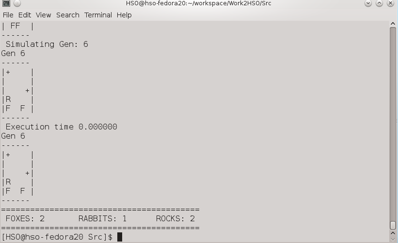
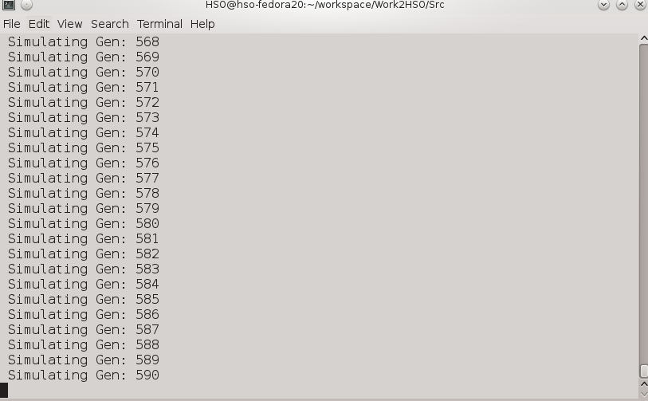
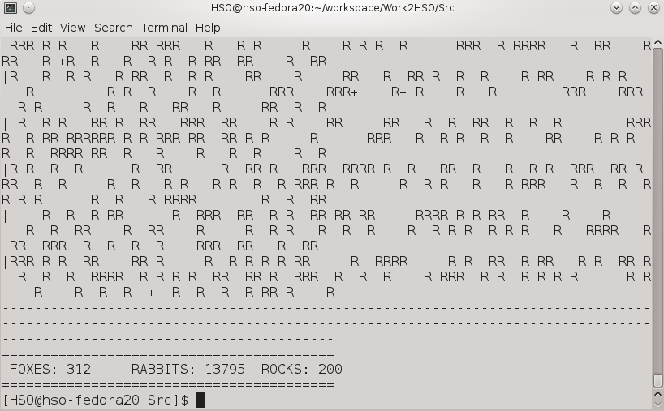

## Synopsis

Ecosystem Simulation.
Work developed in the CP from FCUP.

 
## Features 

User defines the input file and output file. Alternatively can define the world parameters and generate a random world.

## Videos/Images

Simulation with 5 generations, 5X5 World.  

Simulating with 10000 generations, 200X200 World.  

Simulation results with 10000 generations, 200X200 World.  
  

## Contributors

Main Developer :HSO & Luiz Pirez  
Email: hugo(dot)soares(at)fe(dot)up(dot)pt, lppires(at)visum(dot)pt
